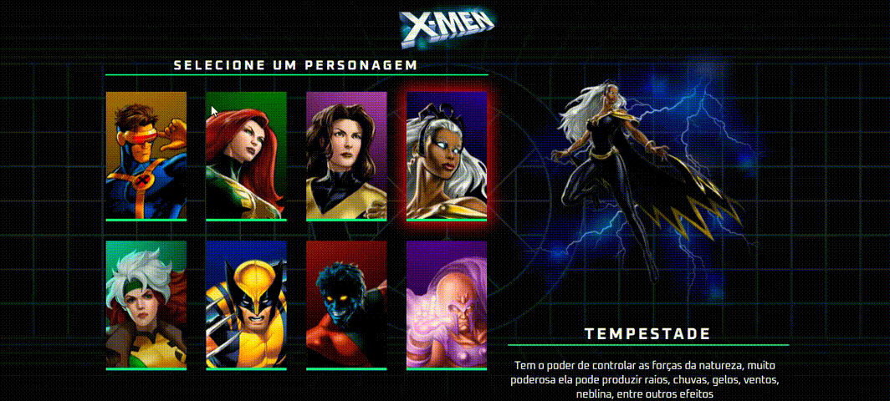

# X-Men

## Resumo
Este projeto foi feito nas lives dos gêmeos do canal [Dev em Dobro](https://www.instagram.com/devemdobro/), onde eu coloquei em prática as tecnologias de HTML, CSS E JAVASCRIPT.

O projeto consiste em uma interface interativa e responsiva, onde os usuários podem explorar e selecionar diferentes personagens e passar o mouse por cima para seleciona-los e ver suas características.

Eu apenas modifiquei pequenas coisas que achei necessário.

## Tecnologias Utilizadas
- **HTML**
- **CSS**
- **JavaScript**

## Veja o funcionamento!

Neste GIF animado, você pode conferir o projeto em pleno funcionamento.

## Acesse o Projeto
Você pode acessar e interagir com o projeto através do GitHub Pages. Clique no link abaixo para experimentar:

➜ [Link do projeto X-men](https://ezequiel-lee.github.io/x-men/)

